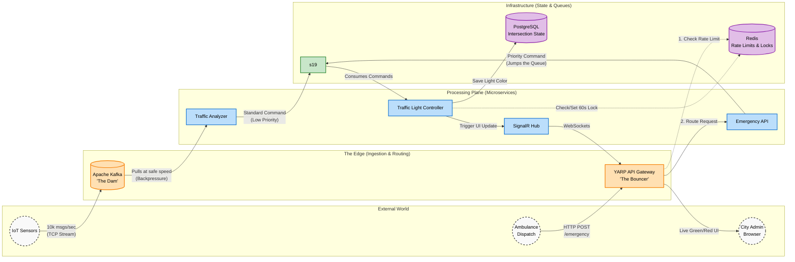

# Architecting a Fault-Tolerant, Event-Driven Smart City Traffic Grid

This repository contains the source code, infrastructure configuration, and documentation for a distributed, cloud-native Smart City Traffic Management System. The project demonstrates how polyglot messaging architectures (Kafka + RabbitMQ) can solve the "Thundering Herd" problem in IoT networks while guaranteeing zero-data-loss emergency routing.

## 🗺️ System Architecture

The system is designed with "Two Front Doors" to handle different types of network traffic safely:
1. **The Dam (Kafka):** Absorbs massive, continuous TCP streams of IoT sensor data without dropping messages.
2. **The Bouncer (YARP):** Protects the internal HTTP APIs using Redis-backed distributed rate limiting.


# 🚦 Smart City Traffic Management System

A distributed, event-driven traffic management system built with **.NET Aspire**, demonstrating high-throughput stream processing (Kafka), reliable command messaging (RabbitMQ), real-time dashboards (SignalR), and intelligent traffic control with emergency vehicle preemption.

---

## 📋 Table of Contents

- [Prerequisites](#-prerequisites)
- [Installation Guide](#-installation-guide)
- [Running the Project](#-running-the-project)
- [Verifying It Works](#-verifying-it-works)
- [Testing Key Features](#-testing-key-features)
- [Project Structure](#-project-structure)
- [Troubleshooting](#-troubleshooting)

### Technology Stack

| Component | Technology | Purpose |
|:---|:---|:---|
| **Orchestration** | .NET Aspire | Local dev orchestration & service discovery |
| **Stream Ingestion** | Apache Kafka | High-throughput sensor telemetry |
| **Command Messaging** | RabbitMQ + MassTransit | Reliable control commands |
| **State Store** | PostgreSQL | Traffic light state persistence |
| **Cache / Locks** | Redis | Distributed locks & rate limiting |
| **API Gateway** | YARP | Routing, rate limiting, auth |
| **Real-Time UI** | SignalR | Live dashboard updates |
| **Observability** | OpenTelemetry | Tracing, metrics, logs |

---

## ✅ Prerequisites

You need the following installed on your machine. Instructions for each are in the next section.

| Requirement | Minimum Version | Why |
|:---|:---|:---|
| **.NET SDK** | 8.0 or later | Build & run the application |
| **Docker Desktop** | Latest | Runs Kafka, RabbitMQ, PostgreSQL, Redis as containers |
| **.NET Aspire Workload** | 8.0+ | Orchestrates the distributed app |
| **Git** | Latest | Clone the repository |
| **An IDE** | VS 2022 / VS Code / Rider | Optional but recommended |

> **💻 Hardware Recommendation:** This project runs ~6 services + 4 containers simultaneously. A minimum of **16GB RAM** is recommended (32GB ideal). A multi-core CPU is strongly advised.

---

## 🔧 Installation Guide

Follow these steps **in order**.

### Step 1: Install the .NET SDK

Download and install the **.NET 8 SDK** (or later) from the official site:

➡️ **https://dotnet.microsoft.com/download**

Verify the installation:

```bash
dotnet --version
```

You should see `8.0.xxx` or higher.

---

### Step 2: Install Docker Desktop

.NET Aspire uses Docker to automatically spin up Kafka, RabbitMQ, PostgreSQL, and Redis containers.

➡️ **https://www.docker.com/products/docker-desktop/**

**After installing:**

1. Launch **Docker Desktop**.
2. Wait until the Docker engine status shows **"Running"** (green).
3. Verify from a terminal:

```bash
docker --version
docker ps
```

> **⚠️ Important:** Docker Desktop **must be running** before you start the project. Aspire will fail to launch the containers otherwise.

> **🪟 Windows Users:** Ensure **WSL 2** is enabled (Docker Desktop will prompt you). This is required for Linux containers.

---

### Step 3: Install the .NET Aspire Workload

The Aspire workload provides the orchestration tooling and project templates.

```bash
dotnet workload update
dotnet workload install aspire
```

Verify it installed:

```bash
dotnet workload list
```

You should see `aspire` in the list.

> **Note:** If you are on .NET 9+, Aspire may be distributed differently. Check the [official Aspire docs](https://learn.microsoft.com/dotnet/aspire/) if the workload command reports it's not found.

---

### Step 4: Clone the Repository

```bash
git clone <your-repository-url>
cd SmartCity
```

---

### Step 5: Restore Dependencies

This downloads all NuGet packages for every project in the solution.

```bash
dotnet restore
```

---

### Step 6: Trust the Development HTTPS Certificate

Aspire and the dashboard use HTTPS locally. Trust the dev certificate:

```bash
dotnet dev-certs https --trust
```

Click **Yes** on any prompt that appears.

---

## ▶️ Running the Project

The entire system is launched with a **single command** via the Aspire AppHost. You do **not** need to start each service manually — Aspire orchestrates everything, including the Docker containers.

### Step 1: Ensure Docker Desktop Is Running

Double-check the Docker engine is up (green status). Aspire will create the containers automatically.

### Step 2: Launch the AppHost

From the **root of the repository**, run:

```bash
dotnet run --project SmartCity.AppHost
```

> **Alternatively**, if using Visual Studio, set `SmartCity.AppHost` as the startup project and press **F5**.

### Step 3: What Happens on First Launch

On first run, Aspire will:

1. 🐳 Pull and start the Docker containers: **Kafka**, **RabbitMQ**, **PostgreSQL**, **Redis**.
2. ⏳ Wait for each container to become healthy.
3. 🚀 Start all .NET services in dependency order.
4. 🌐 Open the **Aspire Dashboard** in your browser automatically.

> **⏱ First launch is slow** (2-5 minutes) because Docker downloads the container images. Subsequent launches are much faster.

### Step 4: Open the Aspire Dashboard

The console output will display a dashboard URL with a login token, like:

```
Login to the dashboard at: https://localhost:17000/login?t=<token>
```

Open this URL. You'll see all services, their health status, logs, traces, and metrics.

---

## 🔍 Verifying It Works

### 1. Check the Aspire Dashboard

In the dashboard, confirm all resources show a **green "Running"** state:

| Resource | Type | Should Be |
|:---|:---|:---|
| `kafka` | Container | 🟢 Running |
| `rabbitmq` | Container | 🟢 Running |
| `postgres` | Container | 🟢 Running |
| `redis` | Container | 🟢 Running |
| `sensor-simulator` | Project | 🟢 Running |
| `traffic-analyzer` | Project | 🟢 Running |
| `light-controller` | Project | 🟢 Running |
| `emergency-api` | Project | 🟢 Running |
| `dashboard-service` | Project | 🟢 Running |
| `gateway` | Project | 🟢 Running |

### 2. Open the Live Dashboard

Find the **`gateway`** resource in the Aspire Dashboard, click its endpoint URL, and navigate to:

```
http://localhost:<gateway-port>/dashboard/
```

You should see **20 traffic intersections** rendered as colored circles, with a green **"Connected"** WebSocket status indicator. As the sensor simulator generates traffic, you'll see lights change color in real time.

---

## 🧪 Testing Key Features

### Test 1: Real-Time Dashboard Updates

Simply watch the dashboard. The `SensorSimulator` continuously generates traffic, and the `TrafficAnalyzer` will turn lights GREEN/RED based on congestion. Changes appear on the dashboard within **<100ms**.

### Test 2: Emergency Vehicle Preemption (The Showcase 🚨)

Trigger an ambulance route. Replace `<gateway-port>` with the actual gateway port from the dashboard:

```bash
curl -X POST http://localhost:<gateway-port>/emergency/route \
  -H "Content-Type: application/json" \
  -d '{
    "vehicleId": "AMBULANCE-911",
    "intersectionIds": [101, 102, 103, 104, 105],
    "direction": "Northbound",
    "priority": 10
  }'
```

**Expected result:** On the dashboard, intersections **#101–#105** instantly turn **GREEN** and pulse with a red emergency glow — all within **1 second**.

### Test 3: Rate Limiting

Fire rapid requests to trigger the Redis-backed rate limiter:

```bash
# Send 15 requests quickly (limit is typically 10/min)
for i in {1..15}; do
  curl -X POST http://localhost:<gateway-port>/emergency/route \
    -H "Content-Type: application/json" \
    -d '{"vehicleId":"TEST","intersectionIds":[101],"direction":"N","priority":1}'
  echo ""
done
```

**Expected result:** The first requests return `200 OK`; subsequent ones return `429 Too Many Requests`.

### Test 4: Inspect Distributed Traces

In the Aspire Dashboard, go to the **Traces** tab. Click any trace to see the full request journey across services (e.g., EmergencyAPI → RabbitMQ → TrafficLightController → SignalR).

---

## 📁 Project Structure

```
SmartCity/
├── SmartCity.AppHost/              # 🎯 Aspire orchestrator (START HERE)
├── SmartCity.ServiceDefaults/      # Shared config (OpenTelemetry, health checks)
├── SmartCity.Contracts/            # Shared events & commands (DTOs)
│
├── SmartCity.SensorSimulator/      # Generates IoT traffic telemetry → Kafka
├── SmartCity.TrafficAnalyzer/      # Consumes Kafka, detects congestion → RabbitMQ
├── SmartCity.TrafficLightController/ # Consumes commands, updates PostgreSQL
├── SmartCity.EmergencyAPI/         # Emergency vehicle preemption endpoint
├── SmartCity.DashboardService/     # SignalR hub + HTML/JS frontend
└── SmartCity.Gateway/              # YARP reverse proxy (routing, auth, rate limit)
```

---

## 🛠 Troubleshooting

### ❌ "Docker engine is not running"

**Cause:** Docker Desktop isn't started.
**Fix:** Launch Docker Desktop and wait for the green "Running" status before running the AppHost.

---

### ❌ "no such host is known: <service-name>"

**Cause:** Service discovery issue — a service referenced in the gateway isn't running or registered.
**Fix:** Verify all services are green in the Aspire Dashboard. Ensure the gateway has `.WithReference(<service>)` in `AppHost/Program.cs`.

---

### ❌ Ports already in use / "address already in use"

**Cause:** A previous run didn't shut down cleanly, leaving containers running.
**Fix:** Stop orphaned containers:

```bash
docker ps                 # list running containers
docker stop $(docker ps -q)   # stop all (use with caution)
```

---

### ❌ First launch hangs or times out

**Cause:** Docker is still downloading large container images (Kafka especially).
**Fix:** Be patient on first run (up to 5 min). Watch Docker Desktop's image download progress. Subsequent runs are fast.

---

### ❌ Dashboard shows "Disconnected" (WebSocket)

**Cause:** The `dashboard-service` isn't running, or the gateway WebSocket route is misconfigured.
**Fix:** Confirm `dashboard-service` is green in Aspire. The dashboard auto-reconnects once the service is back up.

---

### ❌ Containers consume too much memory

**Cause:** Running all services + 4 containers is resource-intensive.
**Fix:** Increase Docker Desktop's memory allocation: **Settings → Resources → Memory** (allocate 8GB+).

---

### 🧹 Clean Reset

To completely reset (clear all data and containers):

```bash
# Stop the app (Ctrl+C), then remove the containers and volumes
docker ps -a                      # find the smartcity containers
docker rm -f <container-ids>      # remove them
docker volume prune               # clear persisted data (CAUTION: deletes DB data)
```

---

## 🛑 Stopping the Project

Press **`Ctrl + C`** in the terminal running the AppHost. Aspire will gracefully shut down all services and stop the Docker containers automatically.

---

## 📄 License

This project was developed as a thesis demonstration of distributed event-driven architecture.

---

> **💡 Quick Start Summary:**
> 1. Install **.NET 8 SDK**, **Docker Desktop**, and the **Aspire workload**.
> 2. Start **Docker Desktop**.
> 3. Run `dotnet run --project SmartCity.AppHost`.
> 4. Open the **Aspire Dashboard**, then the **`/dashboard/`** endpoint via the gateway.
> 5. Fire an emergency `curl` and watch the lights turn green! 🚦