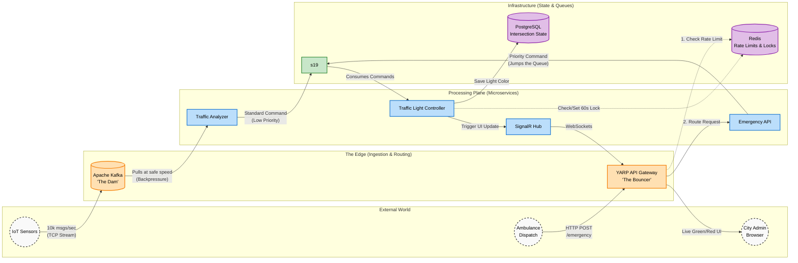

# Architecting a Fault-Tolerant, Event-Driven Smart City Traffic Grid

This repository contains the source code, infrastructure configuration, and documentation for a distributed, cloud-native Smart City Traffic Management System. The project demonstrates how polyglot messaging architectures (Kafka + RabbitMQ) can solve the "Thundering Herd" problem in IoT networks while guaranteeing zero-data-loss emergency routing.

## 🗺️ System Architecture

The system is designed with "Two Front Doors" to handle different types of network traffic safely:
1. **The Dam (Kafka):** Absorbs massive, continuous TCP streams of IoT sensor data without dropping messages.
2. **The Bouncer (YARP):** Protects the internal HTTP APIs using Redis-backed distributed rate limiting.

Smart City Traffic Management — Setup & Run Guide

Prerequisites

Install the following before running the system:

1. .NET SDK 8.0 (or later)

# Verify installation
dotnet --version   # should output 8.0.x or higher

Download: https://dotnet.microsoft.com/download

2. Docker Desktop

Required to run the containerized infrastructure (PostgreSQL, Redis, RabbitMQ, Kafka).

# Verify installation and that the engine is running
docker --version
docker ps          # should run without errors

Download: https://www.docker.com/products/docker-desktop

⚠️ Docker Desktop must be running before you start the application. Aspire provisions all infrastructure as Docker containers automatically.

3. .NET Aspire Workload

dotnet workload update
dotnet workload install aspire

# Verify
dotnet workload list   # 'aspire' should appear

How to Run

Step 1: Clone the Repository

git clone <your-repo-url>
cd <repo-folder>

Step 2: Restore Dependencies

dotnet restore

Step 3: Run the AppHost

The Aspire AppHost orchestrates everything — it starts all infrastructure containers and all microservices with a single command:

dotnet run --project SmartCity.AppHost

That's it. There is no manual setup for PostgreSQL, Redis, RabbitMQ, or Kafka — Aspire pulls the Docker images, starts the containers, wires up the connection strings, and launches every service automatically.

Step 4: Open the Aspire Dashboard

After startup, the console prints a dashboard URL with a login token:

Login to the dashboard at: https://localhost:17000/login?t=<token>

Open this URL in your browser. The dashboard shows all running services, their health, logs, traces, and metrics.

What Gets Started

Component Type Purpose
PostgreSQL Infrastructure Persistent intersection state storage
Redis Infrastructure Caching, distributed locks, rate limiting
RabbitMQ Infrastructure Command & control message broker
Kafka Infrastructure High-throughput telemetry stream
SensorSimulator Service Generates simulated IoT traffic data
TrafficAnalyzer Service (×4) Analyzes telemetry, detects congestion
TrafficLightController Service Applies state changes to PostgreSQL
EmergencyAPI Service Handles emergency vehicle routing
DashboardService Service Real-time SignalR dashboard
Gateway Service (×3) Single external entry point (YARP)

Accessing the System

Once running, find the live URLs in the Aspire Dashboard. Key endpoints:

Real-Time Dashboard (Live Traffic Map)

Access through the gateway:

http://localhost:<gateway-port>/dashboard/

Shows 20 intersections as colored circles that update in real time.

Trigger an Emergency (Test)

curl -X POST http://localhost:<gateway-port>/emergency/route \
  -H "Content-Type: application/json" \
  -d '{
    "vehicleId": "AMBULANCE-911",
    "intersectionIds": [101, 102, 103, 104, 105],
    "direction": "Northbound",
    "priority": 10
  }'

Watch the dashboard — intersections 101–105 respond within ~1 second.

Infrastructure Management UIs

Each broker/database includes a built-in web UI, accessible via the Aspire Dashboard:

UI Inspects
pgAdmin PostgreSQL database
Redis Commander Redis keys
RabbitMQ Management Queues & messages
Kafka UI Topics & messages

Stopping the System

Press Ctrl + C in the terminal running the AppHost. Aspire gracefully shuts down all services and containers.

To remove persisted data volumes (e.g., Kafka data):

docker volume ls          # list volumes
docker volume prune       # remove unused volumes

Troubleshooting

Problem Solution
Docker is not running Start Docker Desktop and wait until it's fully running
Ports already in use Stop conflicting processes or restart Docker
Containers fail to start Run docker ps -a to inspect; ensure enough RAM is allocated to Docker (≥ 8GB recommended)
Services stuck "Waiting" A dependency (e.g., PostgreSQL) is still starting — wait a moment
Aspire workload missing Re-run dotnet workload install aspire

System Requirements (Recommended)

Disk: ~5GB free for Docker images
OS: Windows 10/11, macOS, or Linux
---